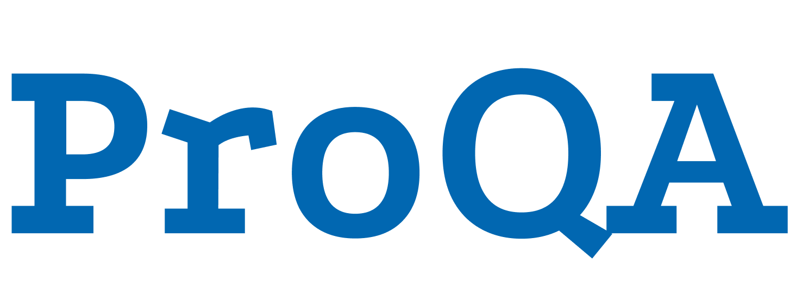

ProQA was developed as a graduation project at the Eindhoven University of Technology in collaboration with Prodrive Technologies. It is a question-answering platform that supports and uses Large Language Models for question answering from any provided collection of PDF and DOCX files.

Note that this repository was copied to my profile for the profile to serve as a portfolio. The code is not free to use, copy, or otherwise redistribute.
